# Ocean Journey: Cruise Booking System

"Ocean Journey" is a comprehensive cruise booking system designed to streamline the process of booking cruises for users. Built using Java, JSP, Servlet, JDBC, HTML, CSS, JavaScript, and Bootstrap, this project offers a seamless experience for both customers and administrators.

## Features

- **User Authentication**: Secure user authentication system allows users to create accounts, log in, and manage their profiles.
- **Cruise Booking**: Users can browse available cruises, select preferred dates, cabins, and amenities, and book their desired cruise.
- **Admin Dashboard**: Administrators have access to a dashboard where they can manage cruises, view bookings, and update cruise information.
- **Responsive Design**: Ocean Journey is built with a responsive design, ensuring a consistent experience across devices.

## Technologies Used

- **Java**: Backend development and business logic implementation.
- **JSP (JavaServer Pages)**: Dynamic web page generation for presenting server-side data.
- **Servlet**: Handles requests from clients, processes them, and returns a response to the client.
- **JDBC (Java Database Connectivity)**: Provides Java API for accessing relational databases.
- **HTML, CSS, JavaScript**: Frontend development for creating the user interface and enhancing user experience.
- **Bootstrap**: Frontend framework for designing responsive and mobile-first websites.

## Usage

1. Access the application through your web browser.
2. Create an account or log in if you already have one.
3. Browse available cruises, select your desired options, and proceed with the booking process.
4. Admins can access the dashboard by navigating to `/admin` and log in with admin credentials.

## Modules Screen Shots

### Home Page
<!-- 

  
&nbsp; &nbsp; &nbsp; &nbsp;
  

 -->

---

### User Login

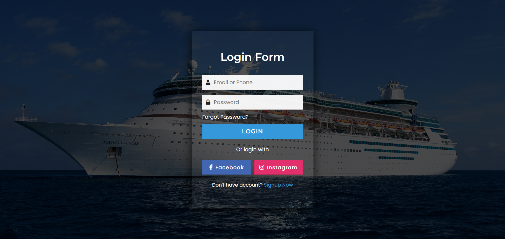

---

### User book1

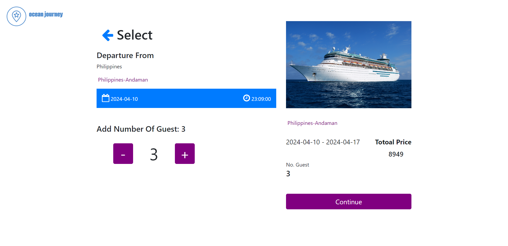

---

### User book2

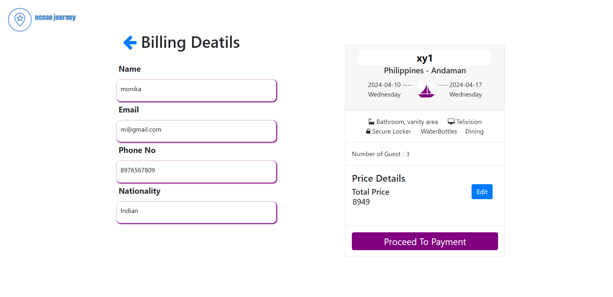

---

### User book3

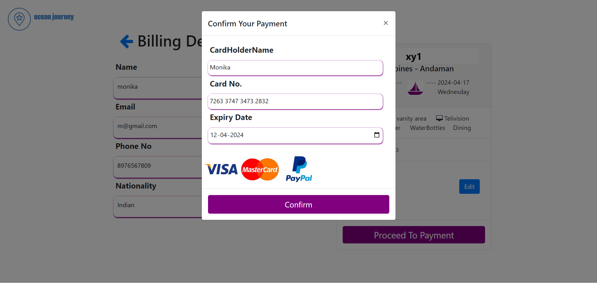

---

### User book4

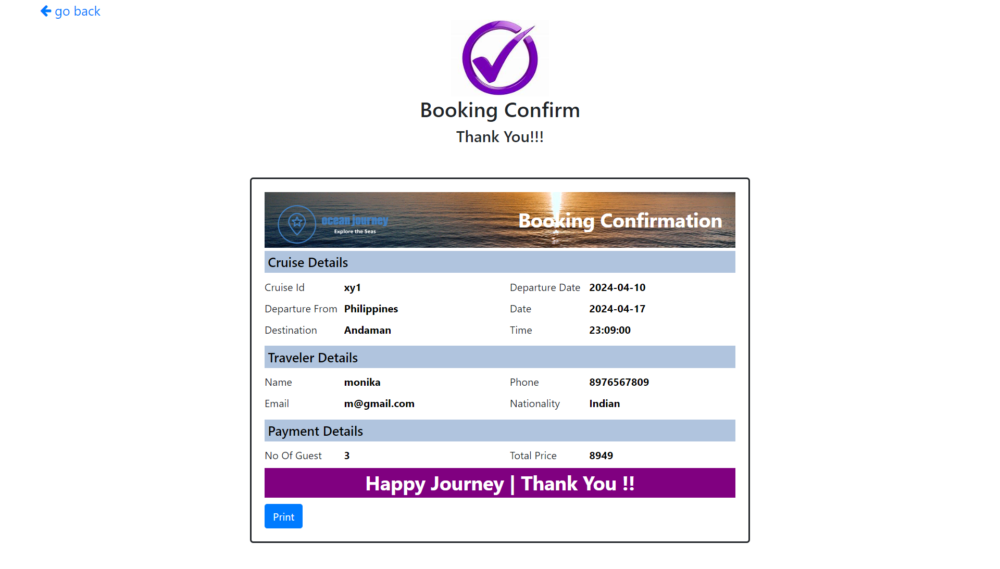

---

### User book5

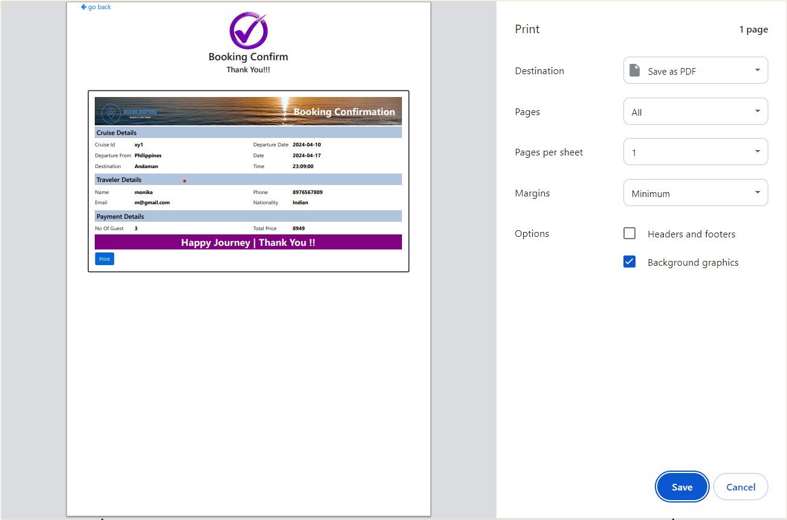

---

### User Profile

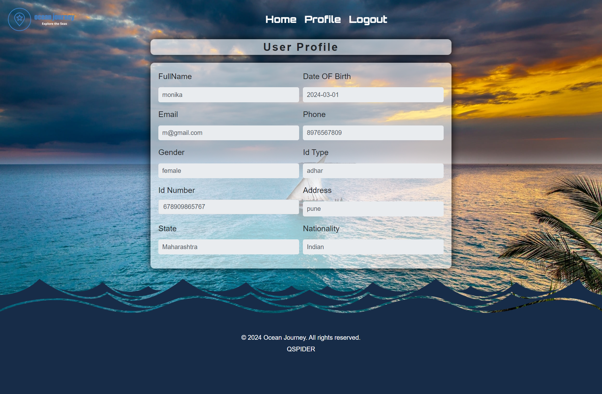

---

### Admin Login

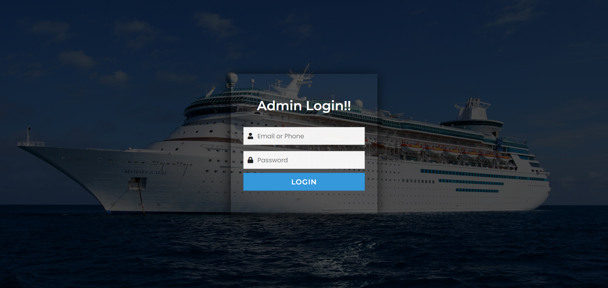

---

### Admin Dashboard

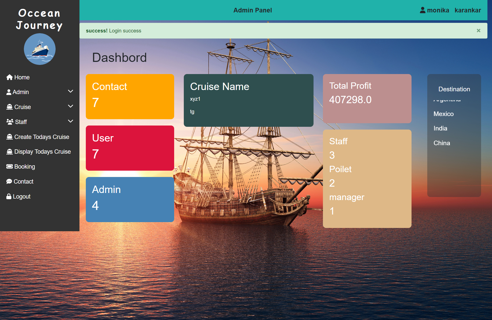

---

### Create Cruse

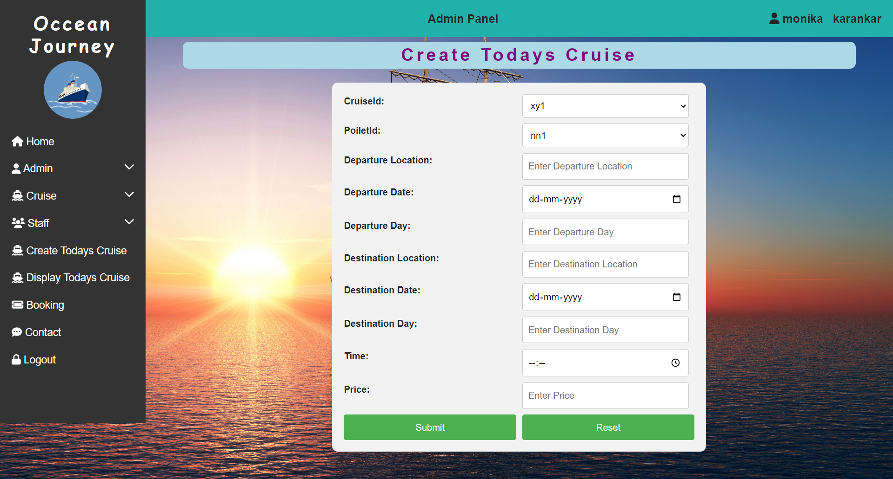

---

### Add Cruse

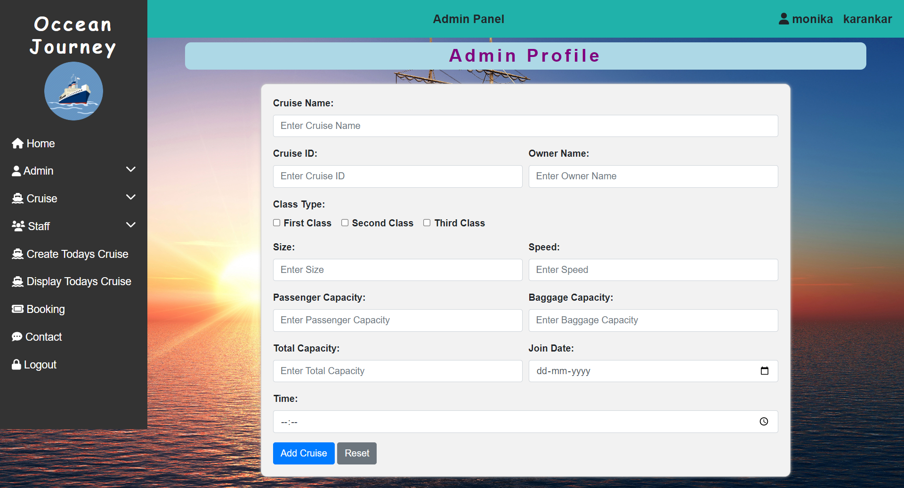

---

### Show Cruse
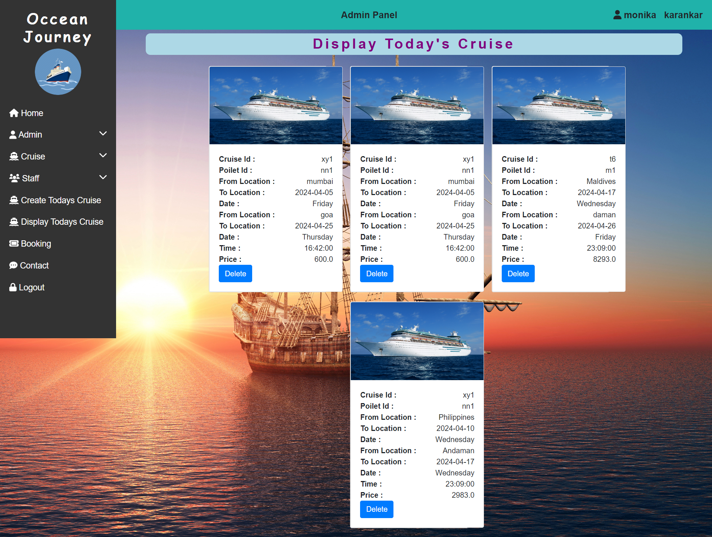

---

### User Login

---

### Staff List

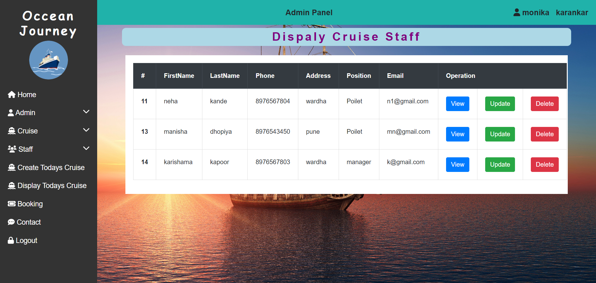

---

### Show Cruse

---

### Cruse List

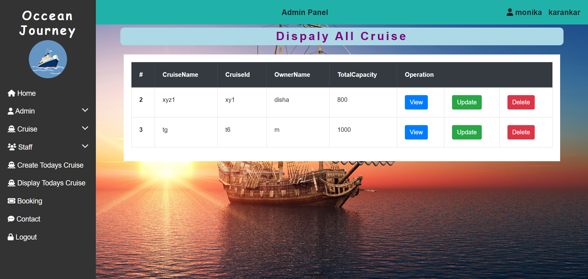

---

### Admin List

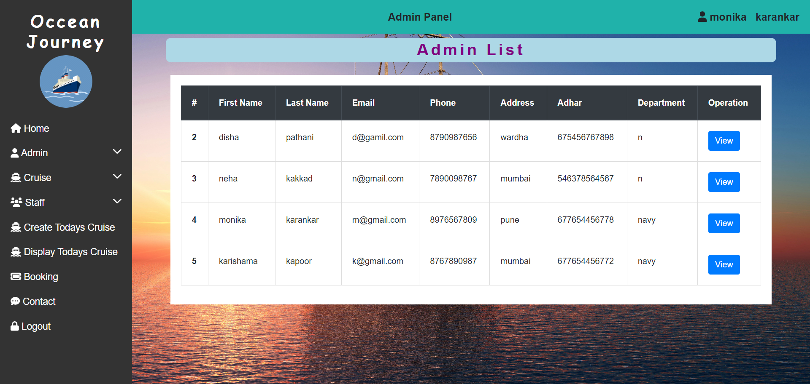

